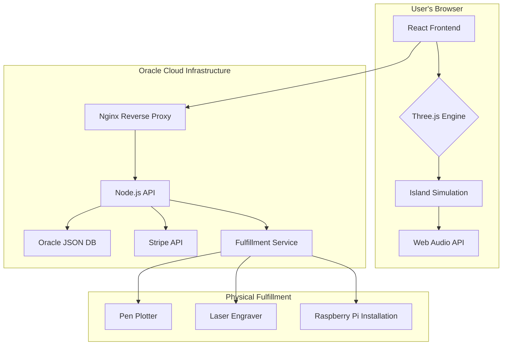

# 🏝️ 404islands - Comprehensive Technical Plan

## 1. Executive Summary

**Vision**: To create a generative art platform featuring 404 unique, living digital islands. Each island will be a persistent, evolving ecosystem simulated in the browser, with ownership opportunities that bridge the digital and physical realms.

**Core Innovation**: A browser-based procedural simulation engine that combines nature-inspired mathematical patterns with real-world physical art fulfillment. This creates a "living digital sculpture garden" where users can influence and own a piece of a constantly evolving world.

## 2. System Architecture

### 2.1. Technology Stack

| Component | Technology | Rationale |
|---|---|---|
| **Frontend** | React 18 + TypeScript | Component-based architecture, strong typing for maintainability. |
| **3D Rendering** | Three.js / WebGL | High-performance, hardware-accelerated 3D graphics in the browser. |
| **State Management** | Zustand | Simple, scalable state management for React. |
| **Backend** | Node.js + Express | Lightweight, scalable, and well-suited for real-time applications. |
| **Database** | Oracle Autonomous JSON DB | Free tier availability, flexible JSON document storage for island state. |
| **Authentication**| OAuth 2.0 (Google, GitHub) | Secure and convenient user authentication. |
| **Deployment** | Docker | Containerization for consistent development and production environments. |
| **CI/CD** | GitHub Actions | Automation of testing, building, and deployment workflows. |
| **Web Server** | Nginx | High-performance reverse proxy and load balancer. |
| **Payment Processing**| Stripe | Secure and reliable payment processing for subscriptions and purchases. |

### 2.2. Architecture Diagram



## 3. Core Island Simulation

### 3.1. Nature-Inspired Algorithms

| System | Algorithm | Implementation |
|---|---|---|
| **Geology** | Perlin Noise, Fractional Brownian Motion | Generation of unique, deterministic island terrain. |
| **Hydrology** | Sine Waves, Gerstner Waves | Realistic ocean waves and water simulation. |
| **Atmosphere** | Metaballs, Curl Noise | Dynamic cloud formation and wind patterns. |
| **Biology** | Cellular Automata, L-Systems | Procedural generation of flora and fauna. |
| **History** | Stochastic Events | Random events that shape the island's history (e.g., storms, fires). |

### 3.2. Island Data Structure

```typescript
interface Island {
  id: number; // 1-404
  seed: string; // Deterministic generation seed
  ownerId?: string;
  createdAt: Date;
  updatedAt: Date;

  // Simulation parameters
  time: number; // In-game time
  season: 'spring' | 'summer' | 'autumn' | 'winter';
  weather: {
    windSpeed: number;
    cloudCover: number;
    precipitation: number;
  };

  // Controllable parameters (for owners)
  controls: {
    weatherIntensity: number;
    seasonLength: number;
  };

  // Historical events
  history: Array<{
    timestamp: Date;
    event: string;
    description: string;
  }>;
}
```

## 4. Monetization and Ownership

### 4.1. Ownership Tiers

| Tier | Price | Features | Physical Artifacts |
|---|---|---|---|
| **Visitor** | Free | Observe any island, limited interaction. | None |
| **Steward** | $10/year | Control weather and season parameters of one island. | Pen plotter drawing of the island. |
| **Guardian** | $100 (one-time) | Perpetual ownership and control of one island. | Framed digital display with a live simulation of the island. |

### 4.2. Revenue Streams

*   **Annual Subscriptions**: Recurring revenue from Steward-tier owners.
*   **One-Time Purchases**: Revenue from Guardian-tier owners.
*   **Physical Art Sales**: A la carte sales of plotter drawings and other merchandise.

## 5. Development Roadmap

### Phase 1: Foundation (Months 1-2)

*   [x] Set up Oracle Cloud Infrastructure.
*   [x] Install and configure Docker.
*   [x] Create a comprehensive technical plan.
*   [ ] Implement core backend services for island generation.
*   [ ] Develop a basic frontend with island rendering.

### Phase 2: Simulation and Interaction (Months 3-4)

*   [ ] Implement weather and season simulation.
*   [ ] Develop user authentication and ownership system.
*   [ ] Create the Steward-tier control interface.

### Phase 3: Monetization and Fulfillment (Months 5-6)

*   [ ] Integrate Stripe for payment processing.
*   [ ] Develop the Guardian-tier ownership and fulfillment pipeline.
*   [ ] Implement the physical art generation and shipping process.

### Phase 4: Launch and Polish (Months 7-8)

*   [ ] Deploy the application to production.
*   [ ] Conduct a beta testing program.
*   [ ] Refine the user experience and fix bugs.

## 6. Deployment and CI/CD

### 6.1. CI/CD Pipeline (GitHub Actions)

1.  **Push to `develop`**:
    *   Run linting and unit tests.
    *   Build Docker images for backend and frontend.
    *   Push Docker images to a container registry.
2.  **Merge to `main`**:
    *   Deploy the application to the OCI instance using the latest Docker images.
    *   Run integration tests.

### 6.2. Deployment Strategy

The application will be deployed as a set of Docker containers on the OCI instance. Nginx will act as a reverse proxy, directing traffic to the appropriate container. The database will run as a separate service on the OCI instance.

## 7. Risk Assessment

| Risk | Mitigation |
|---|---|
| **Oracle Free Tier Limitations** | Monitor resource usage closely, optimize queries and code, and have a plan to upgrade to a paid tier if necessary. |
| **Browser Performance** | Optimize 3D rendering, use Web Workers for heavy computations, and provide graceful degradation for older devices. |
| **Physical Fulfillment Logistics** | Partner with a reliable fulfillment service, start with a small pilot program, and have contingency plans for supply chain issues. |
