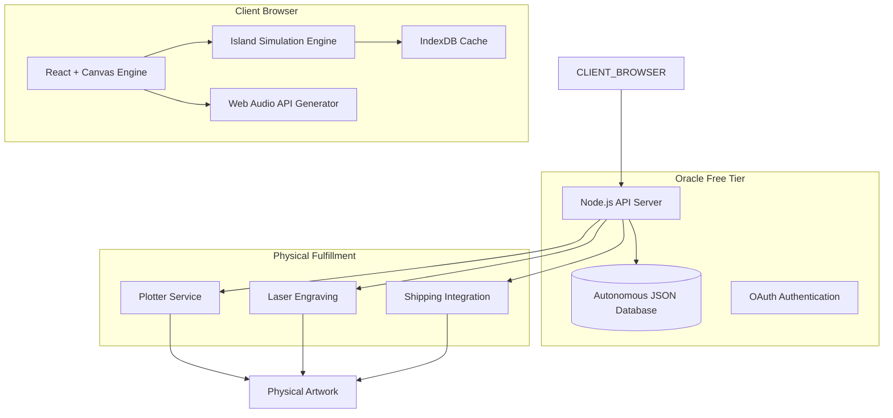
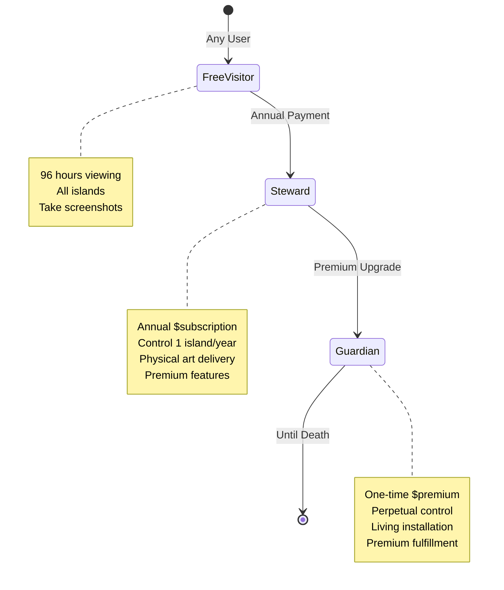
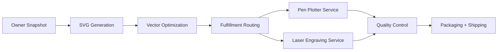
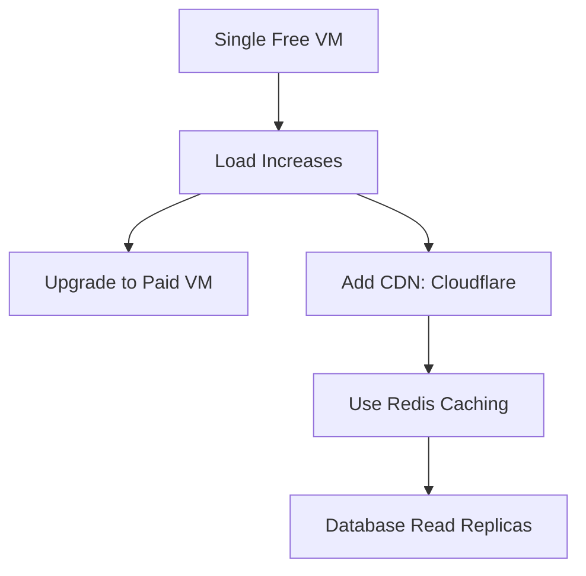

# 🏝️ 404islands - Technical Architecture Plan

## Executive Summary

**Vision**: Transform the voxel project's mathematical modeling expertise into a digital art platform featuring 1,000 unique, living islands - inverting the concept from astronomical observation to intimate, nature-inspired digital ecosystems.

**Core Innovation**: Browser-based procedural simulation engine combined with physical art fulfillment, creating the world's first "living digital sculpture garden" where users can own controlling influence over islands that evolve perpetually through time.

---

## 🏛️ System Architecture



### Technology Stack

| Component | Technology | Rationale |
|-----------|------------|-----------|
| **Frontend** | React 18 + TypeScript | Component-based architecture, strong typing |
| **Simulation** | HTML5 Canvas + WebGL | Hardware-accelerated procedural generation |
| **Audio** | Web Audio API + Tone.js | Native browser audio synthesis |
| **3D/Physics** | Three.js + Cannon.js | Nature-inspired physics simulation |
| **Backend** | Node.js + Express | Lightweight, scalable API |
| **Database** | Oracle Autonomous JSON | Free tier availability, JSON document storage |
| **Authentication** | OAuth 2.0 + JWT | Secure but frictionless access |
| **Cloud** | Oracle Cloud Free Tier | Always free compute and storage |
| **Caching** | IndexDB + Service Workers | Offline-first experience |
| **Build** | Vite + Rollup | Fast, optimized production builds |

---

## 🌊 Core Island Simulation System

### Nature Physics Representation

| Natural System | Algorithm | Implementation | User Control |
|----------------|-----------|----------------|--------------|
| **Geology** | Fractional Brownian Motion + Perlin Noise | Terrain generation: mountain ranges, valleys, coastlines | ❌ Fixed (island identity) |
| **Hydrology** | Navier-Stokes simplified equations + particle systems | Ocean currents, wave simulation, shore foam | ✅ Wind influence, water color |
| **Atmosphere** | Metaball systems + flow fields | Cloud formation, wind patterns, precipitation | ✅ Cloud density, storm frequency |
| **Biology** | Cellular automata + L-systems | Vegetation growth, animal movement, ecosystem dynamics | ✅ Growth rates, species composition |
| **Climate** | Seasonal sine waves + astronomical positioning | Temperature cycles, daylight patterns, tidal effects | ✅ Season intensity, celestial positioning |

### Island Data Structure

```typescript
interface IslandState {
  // Core Identity
  seed: string;              // Deterministic generation seed
  islandNumber: number;      // 1-1000 unique identifier
  ownerId?: string;          // Ownership record

  // Temporal State
  age: number;               // Years since creation
  season: 'spring' | 'summer' | 'autumn' | 'winter';
  timeOfDay: number;         // 0-24 hours

  // Environmental Parameters
  terrain: TerrainConfig;    // Fixed coastline, heightmap
  weather: WeatherParams;    // User-controllable climate
  biota: BiotaConfig;        // Ecosystem parameters

  // Dynamic Elements
  clouds: CloudEntity[];
  raindrops: RaindropEntity[];
  vegetation: VegetationEntity[];
  wildlife: WildlifeEntity[];

  // Historical Events
  events: HistoricalEvent[];
}

// Owner Control Preferences
interface OwnerPreferences {
  weatherIntensity: number;    // 0.1 - 2.0
  seasonLength: number;        // 0.5 - 2.0
  cloudDensity: number;        // 0.0 - 1.0
  windStrength: number;        // 0.0 - 5.0
  ecosystemRichness: number;   // 0.5 - 3.0
}
```

---

## 💰 Monetization Framework

### Ownership Tiers



### Revenue Streams

1. **Annual Stewardship Fees**
   - Base: $49/year/island
   - Premium: $99/year/island (early renewal)
   - Multi-island discounts

2. **Perpetual Guardianship**
   - Base: $499/island (one-time)
   - Heritage: $999/island (multi-generation)
   - Legacy: $2499/island (institutional/family)

3. **Physical Art Sales**
   - Plotter art: $149 (included in stewardship)
   - Engraved amulet: $89 (included in stewardship)
   - Digital installation: $799+ (guardian premium)

---

## 🎨 Physical Art Fulfillment Pipeline

### Production Workflow



### Technical Specifications

#### Pen Plotter Integration
- **Input Format**: SVG optimized for A2/A3 paper
- **Resolution**: 720 DPI minimum
- **Ink Types**: Pigmented archival inks
- **Paper**: Acid-free 100% cotton rag, 200gsm
- **API**: RESTful service with job queuing

#### Laser Engraving
- **Material**: Cherry wood plaques, 3mm thick, beech or walnut
- **Size**: 120x80mm island silhouette outline
- **Engraving**: 0.5mm depth, 100W CO2 laser
- **API**: Integration via MakerCase.com or similar

#### Raspberry Pi Installation
- **Hardware**: Pi 4B 4GB + 7" touchscreen
- **Software**: Custom Chromium kiosk mode
- **Power**: Built-in UPS battery
- **Display**: 800x600 resolution, 5:4 aspect ratio
- **Frame**: Premium wooden/metal housing

---

## 🎵 Sound Generation Engine

### Audio Architecture

```typescript
class IslandSoundscape {
  // Ambient layers
  oceanGenerator: OceanReverb;
  windGenerator: PerlinWindNoise;
  biomeGenerator: EcosystemAudio;

  // Event audio
  stormGenerator: LightningThunder;
  wildlifeGenerator: SpatialAudioAnimals;

  // User interaction
  interactionAudio: FeedbackSounds;
}
```

### Nature-Inspired Audio

| Sound Source | Algorithm | Technique | User Control |
|-------------|-----------|-----------|--------------|
| **Ocean Waves** | FFT-based phase modulation | Surrogate waveset synthesis | Wave intensity |
| **Wind** | Pink noise + formant filtering | Dynamic spectral tilt | Direction & strength |
| **Thunder** | Fractal impulse generation | Filtered pink noise bursts | Storm intensity |
| **Biology** | Markov chain sequencing | Stochastic rhythm generation | Species richness |
| **Rain** | Particle system audio | Individual drop synthesis | Density & tempo |

---

## 🖥️ Oracle Free Tier Infrastructure

### Service Breakdown

| Component | Oracle Service | Specs | Monthly Usage (Free) |
|-----------|---------------|-------|---------------------|
| **API Server** | Always Free Compute | AMD-based VM 2GB RAM | 2 VMs × 2000 hours |
| **Database** | Autonomous DB | 2 DBs × 1GB + backup | Unlimited operations |
| **Storage** | Block/Object Storage | 200GB total | 10GB free + monthly credits |
| **Load Balancer** | Flexible LB | 1 instance | 200 hours free |
| **Monitoring** | Application Performance | Basic metrics | 2 million data points |

### Scaling Strategy



### Cost Optimization

- **Database**: Use document storage for island state, avoid relational complexity
- **Compute**: Auto-scaling, background processing during off-peak
- **Storage**: Compress generational art assets, strategic caching
- **CDN**: Cloudflare free tier for static assets, global distribution

---

## 📈 Development Roadmap

### Phase 1: Foundation (Months 1-2)
- ✅ Clean architecture implementation
- ✅ Core island generation (Perlin/fBm terrain)
- ✅ Basic browser simulation loop
- ✅ Oracle Free Tier infrastructure setup

### Phase 2: Atmosphere & Weather (Months 3-4)
- ☑️ Dynamic cloud systems
- ☑️ Wind and weather physics
- ☑️ Season cycle implementation
- ☑️ Soundscape prototype

### Phase 3: Ecosystems & Life (Months 5-6)
- ⭕️ Vegetation propagation systems
- ⭕️ Wildlife simulation
- ⭕️ Event system for catastrophes
- ⭕️ Island aging system

### Phase 4: Monetization & Ownership (Months 7-8)
- ⭕️ User authentication system
- ⭕️ Owner control interfaces
- ⭕️ Payment processing integration
- ⭕️ Database schema for ownership

### Phase 5: Physical Fulfillment (Months 9-10)
- ⭕️ Plotter integration and optimization
- ⭕️ Laser engraving service setup
- ⭕️ Shipping and fulfillment pipeline
- ⭕️ Raspberry Pi gallery installation

### Phase 6: Launch & Marketing (Months 11-12)
- ⭕️ Public website and gallery
- ⭕️ Beta testing and user acquisition
- ⭕️ Marketing campaign development
- ⭕️ Production line optimization

---

## 🎯 Success Metrics & KPIs

### Technical KPIs
- **Client Performance**: <16ms frame time, <50MB memory usage
- **Server Scalability**: Support 10K concurrent simulations
- **Availability**: 99.9% uptime on Oracle Free Tier
- **Content Generation**: 1000 unique islands pre-computed

### Business KPIs
- **User Acquisition**: 5000 free visitors/month in Year 1
- **Conversion Rate**: >10% visitor to steward conversion
- **LTV**: Average $200-300 per user across lifetime
- **Fulfillment Success**: 99% on-time physical delivery

### Art KPIs
- **Critique Reception**: Coverage in major design/art publications
- **Gallery Display**: Featured in 5+ virtual/exhibition spaces
- **Community Engagement**: Active guild/forum with 10K+ members

---

## ⚠️ Risk Assessment & Mitigation

### Technical Risks
| Risk | Impact | Mitigation |
|------|---------|------------|
| **Browser Compatibility** | High | Progressive enhancement, fallbacks, extensive testing |
| **Oracle Free Tier Limits** | Medium | Architecturally prepared for scaling, usage monitoring |
| **Canvas Performance** | Medium | WebGL fallback, optimization, mobile considerations |
| **Web Audio API Issues** | Low | Fallback to pre-generated audio samples |

### Business Risks
| Risk | Impact | Mitigation |
|------|---------|------------|
| **Competition** | Medium | Unique physical-digital hybrid, technical depth |
| **Art Market Volatility** | Medium | Gradual rollout, test markets, feedback loops |
| **Fulfillment Complexity** | High | Pilot programs, quality partnerships, contingency vendors |

### Operational Risks
| Risk | Impact | Mitigation |
|------|---------|------------|
| **Single Developer** | Medium | Documentation-first approach, modular design |
| **Supply Chain Disruption** | Low | Diversified fulfillment partners, inventory buffers |

---

## 🚀 Implementation Recommendations

### For Investors/Technical Partners
1. **Technical Proof**: Develop Phase 1 core simulation in 4 weeks
2. **Market Test**: Launch with 10 pilot islands, measure engagement
3. **Fulfillment Pilot**: Test physical production with early customers
4. **Scale Plan**: Demonstrate Oracle Free Tier architecture sustainability

### For Development Partners
1. **Code Reviews**: Weekly technical architecture reviews
2. **Performance Benchmarks**: Establish metrics and monitoring
3. **Art Direction**: Regular creative collaboration sessions
4. **User Testing**: Integrated user feedback throughout development

This technical specification provides a comprehensive blueprint for transforming the voxel project's technical expertise into a viable, scalable, and commercially successful digital art platform. The architecture leverages the team's existing mathematical modeling skills while introducing innovative monetization through physical art and ownership models.