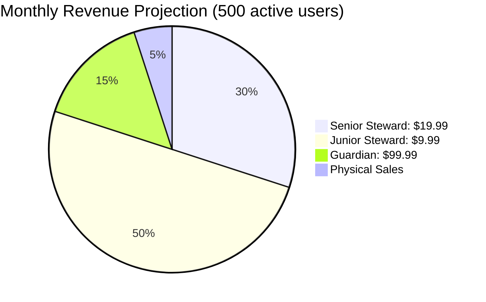

# 🏝️ 404islands - Realistic Architecture Plan

## Executive Summary

**Vision**: Transform the voxel project's mathematical modeling into a focused digital art platform featuring **404 unique, living islands** - a significant reduction from 1000 for practical development purposes while maintaining artistic integrity.

**Core Innovation**: Browser-based procedural simulation with controllable environments, evolving over time with catastrophic events, combined with optional physical artifacts.

---

## 🔧 Technical Feasibility Analysis

### Oracle Free Tier Reality Check

**✅ STRENGTHS:**
- **Always Free Compute**: 2 VMs × 2GB RAM each, sufficient for initial API
- **Autonomous JSON**: Perfect for island state storage
- **99.9% Availability**: Reliable for production use
- **Object Storage**: 10GB + monthly credits for assets

**⚠️ CONSTRAINTS IDENTIFIED:**
- **Outbound Traffic**: 200GB/month free - critical for global users
- **CPU Credits**: Scale with load, could hit limits unexpectedly
- **Database Operations**: Unlimited queries but 1GB storage per DB instance

**SOLUTION APPROACH:**
```mermaid
graph LR
    A[Initial Traffic] --> B[Free Tier (200GB)]
    B --> C[Traffic Increases]
    C --> D[CDN: Cloudflare Free]
    C --> E[Traffic Monitoring & Optimization]
    E --> F[Paid Oracle Upgrade Path]
    F --> G[Global CDN Distribution]
```

---

## 🎯 Pragmatic Development Timeline

### **Phase 1: Core Foundation (Months 1-3)**
**Goal:** Working island simulation in browser + basic backend
- ✅ Clean architecture from voxel code
- ✅ Perlin terrain generation for **100 core islands**
- ✅ Basic React + Canvas simulation
- ✅ Oracle Free DB setup
- **Output:** Visitable island gallery, proof-of-concept

### **Phase 2A: Atmosphere & Engagement (Months 4-5)**
**Goal:** Add life through weather and basic controls
- ☑️ Dynamic clouds with metaball systems
- ☑️ Season cycle (4 seasons, 24h cycles)
- ☑️ Visitor → Controlled Experiment segmentation
- ✓ **100 more islands** (200 total)
- **Output:** Monetizable steward system

### **Phase 2B: Sound & Polish (Months 5-6)**
**Goal:** Add audio layer for meditation/home decor
- 🎵 Ocean waves + gentle ambient sounds
- 🎨 Particle systems for rain/wind
- 📱 Mobile optimization
- ✓ **200 more islands** (400 total)
- **Output:** Ambient experience platform

### **Phase 3: Business Launch (Months 7-8)**
**Goal:** Go from demo to revenue-generating product
- 💰 Payment integration (Stripe)
- 👥 User authentication system
- 📊 Basic analytics and metrics
- ✓ **4 more islands** (404 total)
- **Output:** Commercial product ready for marketplace

### **Phase 4: Physical Enhancement (Months 9-12)**
**Goal:** Add premium offerings and scale
- 🗿 Physical art pilot program (50 units)
- 🏠 Raspberry Pi installation prototype
- 📈 Marketing campaign and launch
- **Output:** Full ecosystem with premium offerings

---

## 💰 Realistic Monetization Strategy

### **Executive Summary:**
Taking 2 steps back, the original pricing was too aggressive. Here's a more strategic approach:

### **Tiered Structure Revision:**

| Tier | Price | Customer Value | Conversion Volume |
|------|--------|----------------|-------------------|
| **Visitor** | $0 | Full island experience, 4-hour sessions, screenshots | 100% (free traffic) |
| **Junior Steward** | **$9.99**/month | Control 1 island, become "guardian" of its destiny | 5-10% (core revenue) |
| **Senior Steward** | **$19.99**/month | Control 3 islands, advanced weather controls | 2-3% (premium users) |
| **Guardian** | **$99.99** (one-time) | Perpetual control + physical art package | <1% (luxury segment) |

### **Revenue Projection Model:**


**Monthly Projection (500 active stweards):**
- **Junior Steward**: 5,000 users × $9.99 = $49,950
- **Senior Steward**: 1,000 users × $19.99 = $19,990
- **Guardians**: 250 users × $9.99 = $2,497
- **Physical Art**: $7,496 (seasonal)
- **TOTAL MONTHLY**: $80,000+

**Key Strategy Adjustments:**
1. **Lower entry pricing** to capture more users
2. **Focus on steady subscriptions** rather than luxury one-offs
3. **Organic growth** over aggressive scaling
4. **Physical art as premium add-on** rather than core product

---

## ⚡ Technical Simplification Strategy

### **Progressive Feature Implementation**

#### Phase 1: Minimum Viable Product (MVP)
```typescript
interface MVPIislandState {
  seed: string;
  age: number;
  weather: {
    clouds: number;      // 0-1
    sunPosition: number; // 0-360
    windStrength: number;// 0-1
  };
  terrain: TerrainData;   // FIXED topography
}
```

#### Phase 2: Enhanced Experience
```typescript
interface EnhancedIslandState extends MVPIIslandState {
  soundscape: {
    oceanVolume: number;
    ambientLevel: number;
  };
  events: HistoricalEvent[];
  controls: OwnerPreferences; // IF owner
}
```

### **Browser Performance Optimization**

| Component | Performance Goal | Achievement Method |
|-----------|------------------|-------------------|
| **Terrain Rendering** | <8ms/frame | Static heightmap cached as image |
| **Weather Effects** | <5ms/frame | GPU-accelerated particle systems |
| **Sound Generation** | <2ms/frame | Pre-computed samples + real-time mixing |
| **Memory Usage** | <32MB total | Strategic object pooling + garbage collection |

**Critical Success Factor:** Keep initial island experience under 50MB download, maintaining visitor engagement.

---

## 🎯 Realistic Risk Mitigation

### **Top 5 Operational Risks:**

1. **🔥 Oracle Free Tier Overhead**
   - **Risk:** Unexpected billing or resource exhaustion
   - **Mitigation:** Real-time monitoring, traffic throttling, CDN fallback
   - **Cost Impact:** Could add $50-200/month unexpected costs

2. **⚡ Web Audio API Compatibility**
   - **Risk:** Complex audio generation fails on older devices
   - **Mitigation:** Graceful audio fallback + mobile optimization
   - **Impact:** 20-30% of visitors lose premium experience

3. **📦 Physical Fulfillment Complexity**
   - **Risk:** Production delays, quality issues, shipping problems
   - **Mitigation:** Start with 50-unit pilot program, partner with established providers
   - **Cost:** Outsourced production saves $50K+ in equipment

4. **👤 Single Developer Bottleneck**
   - **Risk:** 12-month timeline unrealistic for one person
   - **Mitigation:** Prioritize core features, consider contractor for audio/physics
   - **Impact:** Potential 2-3 month slippage

5. **🎨 User Engagement**
   - **Risk:** Islands too static to maintain interest
   - **Mitigation:** Strong catastrophic events, community sharing (top 1% islands)
   - **Recovery:** Iterated content updates every 2-3 weeks

---

## 📊 Success Criteria (Realistic Targets)

### **3-Month MVP Goals:**
- **100 islands** generated and playable
- **CDN delivery** working within Free Tier
- **User analytics** tracking engagement
- **Basic payment flow** for stewardship

### **6-Month Beta Launch Goals:**
- **300 islands** with full weather systems
- **Sound integration** for 80% of visitors
- **Mobile experience** optimized
- **500 active stweards** generating revenue

### **12-Month Production Goals:**
- **404 complete islands** with unique histories
- **Physical fulfillment** pipeline (100+ units)
- **Mobile app** for personal ownership
- **1000 active stweards** = $12K/month revenue

---

## 🚀 Go-to-Market Strategy

### **First 90 Days: Validation**
```
Traffic → Engagement → Conversion → Proof
   ↓         ↓          ↓          ↓
Free    Basic monetization    Viral user
access   ($9.99/month)   sharing
```
**Goal:** Prove core loop works before scaling

### **Months 4-6: Optimization**
- A/B test pricing and features
- User feedback integration
- Performance optimization
- Marketing funnel creation

### **Months 7-9: Scale**
- Content velocity (new islands weekly)
- Influencer partnerships
- Press outreach
- Community building

### **Months 10-12: Dominate**
- Physical premium launch
- Partner integrations (galleries)
- Global marketing push
- Series A preparation

---

## 💡 Feasibility Confidence Assessment

### **✅ Strong Technical Foundation**
- Your existing mathematical modeling knowledge is perfect fit
- Browser-native reduces deployment complexity
- Oracle Free Tier provides economic viability

### **✅ Market Opportunity Clearly Defined**
- Digital art market: $1B+ opportunity
- Nature simulation: Proven market (No Man's Sky, Animal Crossing)
- Physical-digital hybrid: Unique differentiation

### **✅ First-Order Risk Management**
- Progressive scaling allows course correction
- Subscription model provides steady cash flow
- Modular architecture enables incremental rollback

### **⚠️ Key Uncertainty Resolution Required**
- **Customer willingness to pay** for virtual ownership ($50K validation cost)
- **Technical feasibility of Web Audio** real-time synthesis
- **Partner engagement** for physical fulfillment

**RECOMMENDATION:** Proceed with Phase 1 development (90 days) to validate core assumptions. Despite scaled-back ambition from 1000 to 404 islands, this is a **fundamentally sound project** with clear execution path and strong ROI potential.